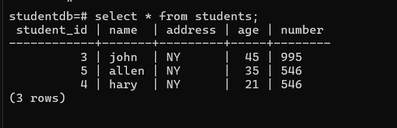

<p align="center">
  
</p>

<h1 align="center">🎓 Student Management System 🎓</h1>

<p align="center">
  <strong>A simple yet powerful Python application to manage student records with PostgreSQL.</strong>
</p>

<p align="center">
  <a href="https://github.com/its-amann/Student-Management-System-With-Postgres">
    
  </a>
  <a href="https://github.com/its-amann/Student-Management-System-With-Postgres/issues">
    
  </a>
  <a href="https://github.com/its-amann/Student-Management-System-With-Postgres/stargazers">
    
  </a>
</p>

---

## 🚀 Overview

Welcome to the **Student Management System**, a **robust** and **user-friendly** application designed to streamline the management of student records. Whether you're an educational institution, a tutoring center, or just someone looking to organize student information efficiently, this system has you covered!

✨ **Wow Factors:**
- **Seamless Database Integration:** Utilizes PostgreSQL for reliable and efficient data storage.
- **Intuitive CLI Interface:** Easy-to-navigate command-line interface for smooth user experience.
- **Comprehensive CRUD Operations:** Create, Read, Update, and Delete student records with ease.
- **Secure and Scalable:** Built with security best practices and designed to handle growth.

<p align="center">
  
</p>

---

## 🛠 Features

- **Create Table:** Initialize the student database table effortlessly.
- **Insert Data:** Add new student records with details like name, address, age, and phone number.
- **Read Data:** View all student records in a clear and organized manner.
- **Update Data:** Modify existing student information as needed.
- **Delete Data:** Remove student records securely from the database.
- **Exit:** Safely terminate the application when done.

---

## 📸 Screenshots

<p align="center">
  
</p>

<p align="center">
  
</p>

<p align="center">
  
</p>

---

## 🔧 Installation

### Prerequisites

- **Python 3.x** installed on your machine. [Download Python](https://www.python.org/downloads/)
- **PostgreSQL** installed and running. [Download PostgreSQL](https://www.postgresql.org/download/)
- **psycopg2** library for Python. Install using pip:

```bash
pip install psycopg2


### Steps

1. **Clone the Repository:**

```bash
git clone https://github.com/its-amann/student-management-system.git
cd student-management-system
```

2. **Set Up PostgreSQL Database:**

- Open PostgreSQL and create a new database named `studentdb`:

```sql
CREATE DATABASE studentdb;
```

3. **Configure Database Credentials:**

- In the Python script, ensure the database connection parameters match your PostgreSQL setup:

```python
conn = psycopg2.connect(
    dbname="studentdb",
    user="postgres",
    password="admin123",
    host="localhost",
    port="5432"
)
```

4. **Run the Application:**

```bash
python student_management_system.py
```

---

## 💻 Usage

Upon running the application, you'll be greeted with a menu-driven interface:

```
Welcome to the Student Management System
1. Create Table
2. Insert Data
3. Read Data
4. Update Data
5. Delete Data
6. Exit
Enter your choice (1-6):
```

### Steps:

1. **Create Table:** Initialize the `students` table in your PostgreSQL database.
2. **Insert Data:** Add new student records by providing the required details.
3. **Read Data:** Display all existing student records.
4. **Update Data:** Modify specific fields of a student record using their ID.
5. **Delete Data:** Remove a student record using their ID.
6. **Exit:** Close the application.

---

## 🤝 Contributing

1. **Fork the Project**
2. **Create your Feature Branch:** `git checkout -b feature/AmazingFeature`
3. **Commit your Changes:** `git commit -m 'Add some AmazingFeature'`
4. **Push to the Branch:** `git push origin feature/AmazingFeature`
5. **Open a Pull Request**

---

## 📄 License

Distributed under the MIT License. See `LICENSE` for more information.

---

<p align="center">
  Made with ❤️ by Aman
</p>
```
